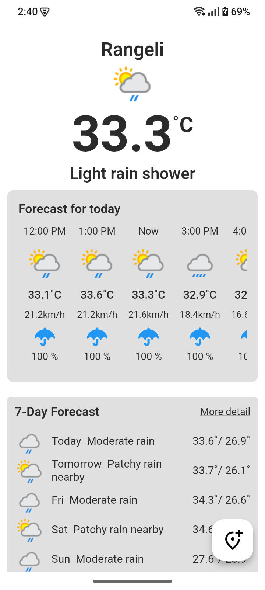
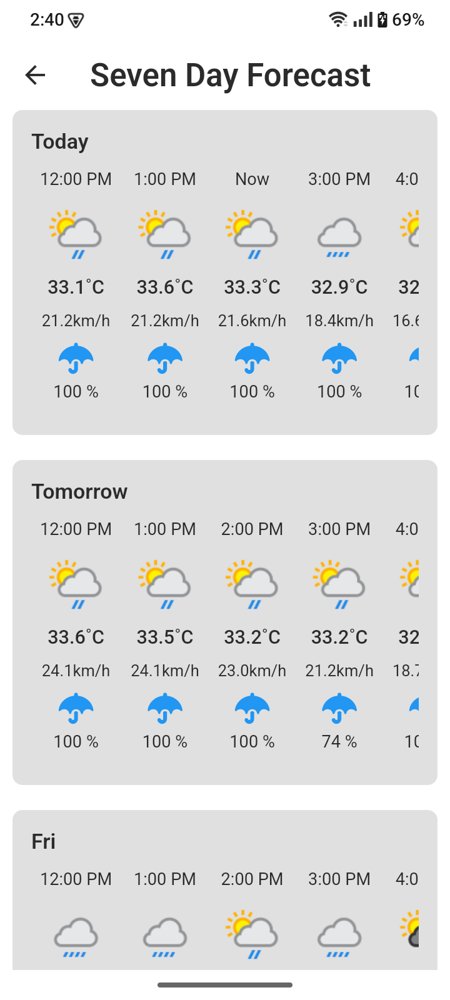
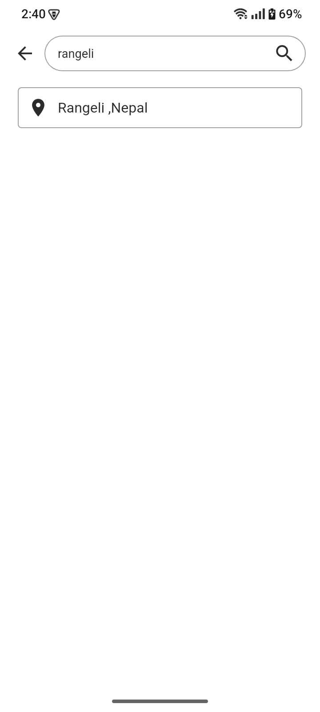

# Weather App 🌤️

A Flutter project that shows real-time weather data, including current weather, hourly forecast, and 7-day forecast.

## Getting Started

This project is a starting point for a Flutter application that provides weather updates for a selected location.

### Features:

- **Main Screen:**
  - Shows current weather (temperature, weather condition, etc.)
  - Displays hourly weather forecast
  - Shows brief 7-day forecast
  - "More Details" option to view detailed hourly forecast for each day

  

- **Forecast Details Screen:**
  - On clicking "More Details", navigates to a screen showing hourly forecasts for each day of the week

  

- **Location Search:**
  - Floating Action Button (FAB) on the main screen opens a location search screen
  - On selecting a location, navigates back and shows weather data for the selected city

  

A few resources to get you started if this is your first Flutter project:

- [Lab: Write your first Flutter app](https://docs.flutter.dev/get-started/codelab)
- [Cookbook: Useful Flutter samples](https://docs.flutter.dev/cookbook)

For help getting started with Flutter development, view the
[online documentation](https://docs.flutter.dev/), which offers tutorials,
samples, guidance on mobile development, and a full API reference.
